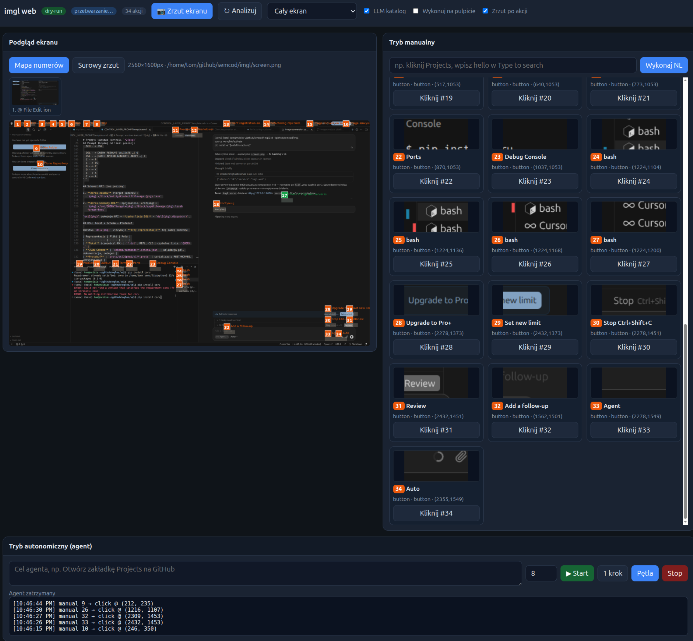

# ImgL - Image to Layout — convert screenshots into semantic UI models with OCR text and element bounding boxes.


## AI Cost Tracking

   
  

- 🤖 **LLM usage:** $16.4598 (14 commits)
- 👤 **Human dev:** ~$825 (8.2h @ $100/h, 30min dedup)

Generated on 2026-06-24 using [openrouter/qwen/qwen3-coder-next](https://openrouter.ai/qwen/qwen3-coder-next)

---

## Installation

```bash
pip install -e .              # from repo
pip install -e ".[capture]"   # mss (X11 fallback)
pip install -e ".[diagnose]"   # numpy for img2nl (install img2nl locally)
pip install -e ".[full]"      # capture + diagnose + dev + llm + web

# Local siblings (not on PyPI) — mirror capture on Wayland:
make install-dev              # .[dev,llm,capture] + vdisplay when ~/github/wronai/vdisplay exists
imgl install vdisplay         # pip install -e ~/github/wronai/vdisplay[pillow]
pip install -e ~/github/wronai/vdisplay[pillow]   # same as above
pip install -e ~/github/wronai/img2nl[analyze]
pip install -e ~/github/oqlos/vql
pip install -e ~/github/oqlos/vql/packages/img2vql
```

For `uri2vql adopt-imgl`, install imgl in the same venv as uri2vql:

```bash
pip install -e ~/github/semcod/imgl
# or: pip install -e ~/github/oqlos/vql/packages/uri2vql[imgl]
```

System dependency for OCR:

```bash
# Debian/Ubuntu
sudo apt install tesseract-ocr tesseract-ocr-pol

# macOS
brew install tesseract tesseract-lang
```

Development install:

```bash
pip install -e ".[dev]"
pip install -e ".[llm]"    # vision LLM catalog (OpenRouter)
```

### Makefile (szybki start)

```bash
make help              # lista komend
make install-full      # imgl + capture + llm + control + web
make capture-interactive  # vdisplay mirror → screen.png (portal fallback na Wayland)
make doctor-full FORMAT=markdown
make execute-llm PROMPT='wpisz test w Chat input'
make demo-key          # dsl2imgl KEY ctrl+Return (dry-run)
make demo-chat         # wpisz w Chat input + ctrl+enter (dry-run)
make serve-rest        # rest2imgl :8219
make serve-web         # imgl serve :8008
make test-dsl2imgl     # testy Fazy 4 (Schema/Protobuf/ES)
```

Integracja z **Koru**: `cd ~/github/semcod/koru && make install-imgl-bridge`

## Documentation

| Temat | Link |
|-------|------|
| Indeks | [docs/README.md](docs/README.md) |
| Capture (mirror, portal, `--analyze`) | [docs/capture.md](docs/capture.md) |
| VQL eksport i vdisplay provenance | [docs/vql-export.md](docs/vql-export.md) |
| Architektura (imgl / vdisplay / vql) | [docs/architecture.md](docs/architecture.md) |
| Warstwa kontroli `*2imgl` | [docs/control-layer.md](docs/control-layer.md) |
| NL ze shell (chat input, Enter/Ctrl+Enter) | [docs/nl-shell-examples.md](docs/nl-shell-examples.md) |
| Głos + przeglądarka | [docs/voice-browser.md](docs/voice-browser.md) |
| Web UI (port 8008) | [docs/web-ui.md](docs/web-ui.md) |
| Paczki kontroli | [packages/README.md](packages/README.md) |

## Examples

Pełna dokumentacja z przykładami dla różnych systemów, aplikacji i konfiguracji:

**[examples/README.md](examples/README.md)**

| Temat | Link |
|-------|------|
| GNOME/Wayland | [examples/platforms/gnome-wayland](examples/platforms/gnome-wayland/README.md) |
| Wybór okna / wycinki | [examples/workflows/window-picker](examples/workflows/window-picker/README.md) |
| GitHub w przeglądarce | [examples/applications/github-browser](examples/applications/github-browser/README.md) |
| IDE (Windsurf/VS Code) | [examples/applications/ide-editor](examples/applications/ide-editor/README.md) |
| LLM per okno | [examples/configurations/per-window-llm](examples/configurations/per-window-llm/README.md) |
| NL → URI (nlp2uri) | [examples/integrations/nlp2uri](examples/integrations/nlp2uri/README.md) |
| Integracja uri2vql | [examples/integrations/uri2vql](examples/integrations/uri2vql/README.md) |
| Pętla agenta | [examples/workflows/multi-step-agent](examples/workflows/multi-step-agent/README.md) |
| Capture → VQL → akcja | [examples/workflows/capture-to-action](examples/workflows/capture-to-action/README.md) |
| Web UI (port 8008) | [examples/workflows/web-ui](examples/workflows/web-ui/README.md) |

Szybkie demo:

```bash
examples/scripts/demo-windows.sh screen.png
examples/scripts/demo-nlp2uri.py screen.png region-top
```

## Usage

### Python API

```python
from imgl import analyze, scene_to_json

scene = analyze("screen.png", lang="eng+pol")
print(scene_to_json(scene))
```

### CLI

```bash
# Use an existing screenshot (recommended on GNOME/Wayland):
imgl diagnose /tmp/screen.png
imgl vql /tmp/screen.png -o layout.vql.json

# Capture (vdisplay mirror wbudowany w imgl[capture] — bez dialogu GNOME):
make install-dev                              # vdisplay + mss w extra capture
make capture-interactive                      # mirror capture → screen.png
make capture-analyze                          # + VQL + .capture.json
imgl capture -o screen.png --verify           # to samo bez make
imgl capture -o screen.png --verify --analyze # capture + VQL + provenance w jednym kroku
imgl capture --portal -o screen.png           # fallback: GNOME region picker

imgl diagnose screen.png            # must show worth_analyzing: true

# analyze / export (aborts on blank unless --allow-blank)
imgl analyze /tmp/screen.png --json
imgl analyze screen.png -o screen.imgl.json --lang eng+pol
imgl html screen.png -o screen.html --embed-image
imgl svg screen.png --mode overlay -o screen.svg
imgl svg screen.png --mode wireframe -o screen.svg
imgl vql screen.png -o layout.vql.json --with-grid
```

### Web UI (manual + agent, port 8008)

```bash
pip install -e ".[web,llm,capture]"
imgl serve --port 8008
# z wykonaniem na pulpicie i LLM:
imgl serve --port 8008 --execute --llm --capture-on-start
```

Otwórz http://127.0.0.1:8008 — podgląd zrzutu z numerami, lista akcji z miniaturkami, NL i pętla agenta (capture → act → capture).

Szczegóły: [docs/web-ui.md](docs/web-ui.md), [docs/voice-browser.md](docs/voice-browser.md).

### Control layer (REST / DSL / NL, port 8219)

Sterowanie z zewnątrz (shell, curl, MCP, asystent głosowy):

```bash
make install-control   # imgl install control
make capture-analyze                          # zalecane: capture + VQL
make capture-interactive                      # lub: imgl capture -o screen.png --verify
make serve-rest        # http://127.0.0.1:8219

# DSL
dsl2imgl exec 'KEY ctrl+Return EXECUTE 0'
dsl2imgl exec 'TYPE "hello" IN "Chat input" IMAGE screen.png WINDOW region-bottom EXECUTE 0'

# NL
nlp2imgl apply "wpisz opisz projekt w Chat input" --image screen.png --window region-bottom
nlp2imgl apply "naciśnij ctrl+enter" --execute
```

Z **Koru** (w `koru/.venv`, nie `imgl/.venv`):

```bash
cd ~/github/semcod/koru && make install-imgl-bridge
make imgl-capture imgl-chat
koru imgl execute "wpisz test w Chat input" --window region-bottom --dry-run
```

Pełne przykłady: [docs/nl-shell-examples.md](docs/nl-shell-examples.md), [docs/control-layer.md](docs/control-layer.md), [docs/vql-export.md](docs/vql-export.md).

### Window discovery (regiony na zrzucie)

Na złożonych zrzutach (przeglądarka + IDE) najpierw wybierz region:

```bash
imgl windows screen.png --export-crops --annotate --open
# → screen.region-top.png, screen.region-bottom.png (+ .numbered.png)

imgl interact screen.png --llm --window region-top    # GitHub
imgl interact screen.png --llm --window region-bottom # IDE
```

Interaktywny wybór okna (gdy jest >1 region):

```bash
imgl interact screen.png --llm
# → lista okien → wpisz numer (1, 2) lub "podglad"
```

### Interactive shell (pick action from catalog)

```bash
imgl interact /tmp/screen.png -o layout.vql.json
# numer opcji, NL: "kliknij Save", "mapa", "lista", "okna", "quit"
# obraz z numerami:
imgl annotate screen.png --open
imgl interact screen.png --annotate --open
# filtr szumu OCR (domyślnie włączony):
imgl interact screen.png
# vision LLM (OPENROUTER_API_KEY + pip install -e ".[llm]"):
imgl interact screen.png --llm --window region-top --annotate --open
# wykonanie na pulpicie (Linux, xdotool/ydotool):
imgl interact /tmp/screen.png --execute
```

URI DSL (`vql://window/imgl?action=...`):

| action | opis |
|--------|------|
| `analyze` | OCR + layout → VQL JSON (domyślne) |
| `list` | lista elementów interaktywnych |
| `annotate` | PNG ze zrzutu + numerowane ramki |
| `click` | `text=`, `element_id=`, `window=` |
| `type` | `value=`, `label=`, `text=` |

Via `uri2vql` (when installed):

```bash
uri2vql query 'vql://window/imgl?image=/tmp/screen.png&file=layout.vql.json&lang=eng'
uri2vql query 'vql://window/imgl?image=/tmp/screen.png&file=layout.vql.json&action=list'
uri2vql query 'vql://window/imgl?image=/tmp/screen.png&file=layout.vql.json&action=click&text=Save'
# For Polish+English OCR in URI use encoded plus: lang=eng%2Bpol
```

NL → URI (`nlp2uri` / `imgl` built-in):

```bash
# w shellu imgl interact: "kliknij Save", "wpisz test w search", "2", "lista"
```

### HTML / SVG export

```python
from imgl import analyze, scene_to_html, scene_to_svg

scene = analyze("screen.png")
html = scene_to_html(scene, embed_image=True)
svg = scene_to_svg(scene, mode="overlay", background="screen.png")
```

HTML uses absolutely positioned elements with `data-type`, `data-id`, `data-text` attributes
for text-based automation (`button[data-text="Save"]`).

SVG supports `wireframe` (flat debug view) and `overlay` (boxes on top of screenshot).

## Output format

`analyze()` returns a `Scene` with:

- `windows` — detected UI windows/panels (local heuristics or optional `img2vql`)
- `elements` — classified UI elements: `button`, `input`, `label`, `text`, `toolbar`
- `ocr_boxes` — raw OCR word boxes with confidence scores

Example JSON:

```json
{
  "version": "1.0",
  "scene": {"width": 800, "height": 600, "source_image": "screen.png"},
  "windows": [{
    "id": "win-screen",
    "bbox": {"x": 0, "y": 0, "w": 800, "h": 600},
    "title": null,
    "z": 0,
    "elements": [
      {"id": "text-0", "type": "text", "text": "Save", "bbox": {"x": 100, "y": 50, "w": 40, "h": 16}}
    ]
  }],
  "ocr_boxes": [],
  "metadata": {"ocr_backend": "tesseract", "lang": "eng+pol"}
}
```

## Configuration

```python
from imgl import ImglConfig, analyze

scene = analyze("screen.png", config=ImglConfig(
    lang="eng+pol",
    use_img2vql=True,      # use img2vql when installed, else local detect
    detect_inputs=True,
    label_proximity_px=40,
))
```

### VQL export

```python
from imgl import analyze, scene_to_vql, write_vql_program

scene = analyze("screen.png")  # metadata.capture + window_os gdy vdisplay + sidecar
program = scene_to_vql(scene, include_grid=True, grid=12)
write_vql_program(scene, "layout.vql.json")
```

Layers: `windows`, `ui_elements` (OCR text + optional `app_label` from vdisplay), `text_regions`, optional `screen_regions`.

Sidecar files: `screen.capture.json` (provenance), cache `layout.vql.imgl.json`. See [docs/vql-export.md](docs/vql-export.md).

### Text-based actions

```python
from imgl import analyze, actions

scene = analyze("screen.png")
ui = actions(scene)

ui.click("button", text="Save")
# {"action": "click", "x": 310, "y": 206, ...}

ui.type_into("alice", label="Username")
# {"action": "type", "x": 245, "y": 99, "text": "alice", ...}
```

CLI:

```bash
imgl find screen.png --type button --text Save --click
imgl find screen.png --label Username --type-into alice
imgl find screen.png --list
```

## Roadmap

Zobacz [TODO.md](TODO.md).

- uri2vql: `window_scope` w handlerze `vql://window/imgl`
- `dsl2imgl` Faza 4: JSON Schema + Protobuf + EventStore
- Web UI: mikrofon (Web Speech API), akcja KEY w panelu
- koru desktop bridge for action execution

## License

Licensed under Apache-2.0.
