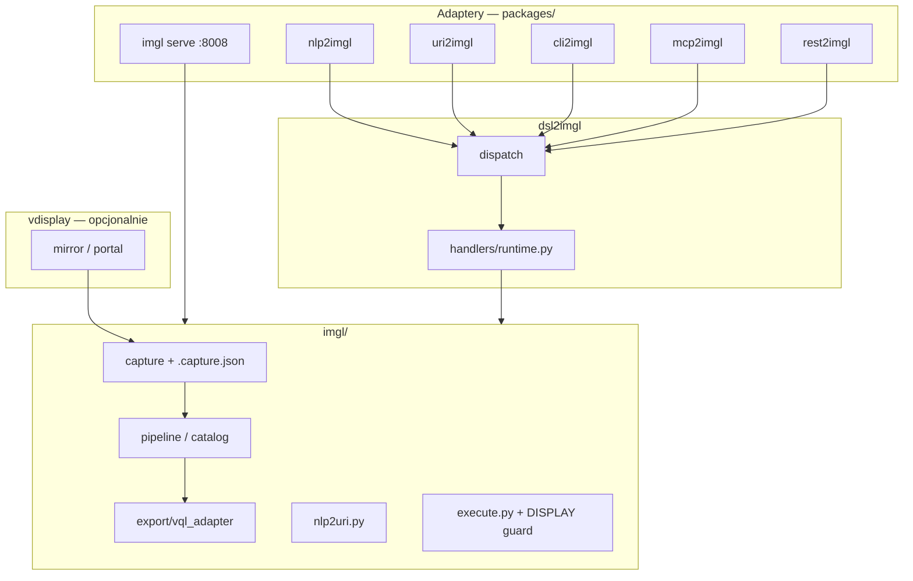

# imgl control packages

Warstwa kontroli zgodna z [CONTROL_LAYER_PROMPT.template.md](/home/tom/github/oqlos/doql/packages/CONTROL_LAYER_PROMPT.template.md).

## Porty

| Usługa | Port | Opis |
|--------|------|------|
| `imgl serve` | **8008** | Web UI (manual + agent, miniaturki) |
| `rest2imgl serve` | **8219** | REST DSL/NL API (8218 = rest2coru) |
| `rest2vql serve` | 8216 | vql capture/program (osobny repo) |

## Diagram



## Pipeline capture → VQL

| Warstwa | Repo / moduł | Rola |
|---------|--------------|------|
| Transport | `vdisplay` | PNG + metadane OS (okna WM, display) |
| Semantyka | `imgl` | OCR, Scene, katalog, execute |
| Eksport | `vql` (format) | `*.vql.json`, URI `vql://window/imgl` |

Po `imgl capture --analyze` powstają sidecary: `.capture.json`, `.vql.json`, `.vql.imgl.json`.

Szczegóły: [docs/vql-export.md](../docs/vql-export.md).

## Paczki

| Paczka | Rola |
|--------|------|
| `dsl2imgl` | Bus DSL: `CAPTURE`, `ANALYZE`, `ACTIONS`, `RESOLVE`, `CLICK`, `TYPE`, `KEY`, `EXECUTE` |
| `uri2imgl` | `vql://window/imgl?...` → linia DSL |
| `nlp2imgl` | NL → DSL → `dispatch()` |
| `cli2imgl` | REPL |
| `mcp2imgl` | MCP stdio tools |
| `rest2imgl` | FastAPI `/v1/dsl`, `/v1/nl` |

## Instalacja (dev)

```bash
cd ~/github/semcod/imgl
pip install -e .
pip install -e packages/dsl2imgl
pip install -e packages/nlp2imgl
pip install -e packages/uri2imgl
pip install -e packages/cli2imgl
pip install -e packages/rest2imgl
pip install -e "packages/mcp2imgl[mcp]"   # opcjonalnie
```

## Verby DSL (runtime)

```text
HEALTH
CAPTURE [OUT screen.png] [INTERACTIVE] [ANALYZE] [LANG eng+pol]
ANALYZE screen.png [WINDOW region-bottom] [LLM]
ACTIONS screen.png [WINDOW region-top] [LLM]
RESOLVE "kliknij Projects" IMAGE screen.png WINDOW region-top
CLICK 3 IMAGE screen.png WINDOW region-top EXECUTE 1
TYPE "moje pytanie" IN "Chat input" IMAGE screen.png WINDOW region-bottom EXECUTE 1
KEY ctrl+Return EXECUTE 1
EXECUTE "wpisz hello w Chat input" IMAGE screen.png EXECUTE 1
```

## Faza 4 (dsl2imgl)

- `schema/commands/*.schema.json` — walidacja dict
- `proto/dsl2imgl/v1/*.proto` — serializacja REST/MCP/ES
- `events.py` — EventStore `.imgl/events/dsl.events.pb`
- `codec.py` + `pb_codec.py` — text/json/protobuf → `dispatch()`

```bash
cd packages/dsl2imgl && bash scripts/generate-proto.sh
pytest packages/dsl2imgl/tests -q
```

## Testy

```bash
pytest packages/dsl2imgl/tests -q
```
