# System Architecture Analysis
<!-- generated in 0.00s -->

## Overview

- **Project**: /home/tom/github/semcod/imgl
- **Primary Language**: python
- **Languages**: python: 88, json: 14, yaml: 7, toml: 7, shell: 7
- **Analysis Mode**: static
- **Total Functions**: 569
- **Total Classes**: 40
- **Modules**: 126
- **Entry Points**: 146

## Architecture by Module

### packages.dsl2imgl.src.dsl2imgl.pb_codec
- **Functions**: 32
- **File**: `pb_codec.py`

### imgl.autodiag
- **Functions**: 32
- **File**: `autodiag.py`

### imgl.window_scope
- **Functions**: 30
- **Classes**: 1
- **File**: `window_scope.py`

### imgl.capture
- **Functions**: 29
- **Classes**: 2
- **File**: `capture.py`

### imgl.cli
- **Functions**: 26
- **File**: `cli.py`

### imgl.detect.local
- **Functions**: 20
- **Classes**: 1
- **File**: `local.py`

### imgl.interact
- **Functions**: 20
- **Classes**: 1
- **File**: `interact.py`

### imgl.web.session
- **Functions**: 18
- **Classes**: 5
- **File**: `session.py`

### imgl.actions
- **Functions**: 17
- **Classes**: 4
- **File**: `actions.py`

### packages.dsl2imgl.src.dsl2imgl.grammar
- **Functions**: 16
- **File**: `grammar.py`

### imgl.llm_catalog
- **Functions**: 16
- **File**: `llm_catalog.py`

### imgl.control
- **Functions**: 16
- **File**: `control.py`

### imgl.export.annotate_export
- **Functions**: 14
- **File**: `annotate_export.py`

### imgl.targets
- **Functions**: 13
- **File**: `targets.py`

### imgl.export.vql_adapter
- **Functions**: 13
- **File**: `vql_adapter.py`

### imgl.vdisplay_bridge
- **Functions**: 12
- **File**: `vdisplay_bridge.py`

### imgl.terminal_md
- **Functions**: 11
- **File**: `terminal_md.py`

### imgl.types
- **Functions**: 10
- **Classes**: 5
- **File**: `types.py`

### imgl.diagnose
- **Functions**: 10
- **Classes**: 1
- **File**: `diagnose.py`

### imgl.vision_ops
- **Functions**: 9
- **Classes**: 2
- **File**: `vision_ops.py`

## Key Entry Points

Main execution flows into the system:

### imgl.web.app.create_app
- **Calls**: None.resolve, SessionManager.create, FastAPI, static_dir.is_dir, app.get, app.get, app.get, app.get

### packages.dsl2imgl.src.dsl2imgl.handlers.runtime.handle_execute
- **Calls**: None.upper, cmd.get, packages.dsl2imgl.src.dsl2imgl.handlers.runtime._build_interact_session, packages.dsl2imgl.src.dsl2imgl.handlers.runtime._run_prompt_act, DslResult, str, imgl.execute.execute_action, DslResult

### imgl.web.session.WebSession.act
- **Calls**: self._step_record, self.history.append, self.resolve_index, self._step_record, self.history.append, result.get, self._step_record, self.history.append

### imgl.vision_ops.match_template_png
> Find template occurrences in a screenshot using OpenCV matchTemplate.
- **Calls**: imgl.vision_ops.template_available, imgl.vision_ops._png_to_gray_array, imgl.vision_ops._png_to_gray_array, None.get, cv2.matchTemplate, zip, matches.sort, RuntimeError

### imgl.types.Scene.from_dict
- **Calls**: data.get, cls, BBox, Element, Window, element_from_dict, OcrBox, data.get

### packages.dsl2imgl.src.dsl2imgl.events.EventStore._append_pb
- **Calls**: result_pb2.DslEvent, pb.command.CopyFrom, DslResult, pb.result.CopyFrom, pb.SerializeToString, packages.dsl2imgl.src.dsl2imgl.pb_codec.dict_to_envelope, packages.dsl2imgl.src.dsl2imgl.pb_codec.result_to_pb, self.path.with_suffix

### packages.dsl2imgl.src.dsl2imgl.events.EventStore._append_jsonl
- **Calls**: event.to_dict, result_pb2.DslEvent, pb_event.command.CopyFrom, DslResult, pb_event.result.CopyFrom, None.decode, self.path.open, fh.write

### examples.scripts.demo-nlp2uri.main
- **Calls**: print, imgl.pipeline.analyze, imgl.window_scope.apply_discovered_windows, imgl.catalog.build_interactive_catalog, InteractSession, print, print, imgl.nlp2uri.prompt_to_imgl_uri

### imgl.vision_ops.render_match_overlay_png
> Draw numbered bounding boxes and confidence labels on a screenshot.
- **Calls**: None.convert, Image.new, ImageDraw.Draw, list, Image.alpha_composite, io.BytesIO, None.save, out.getvalue

### imgl.cli._handle_windows
- **Calls**: imgl.cli._check_blank_before_analyze, imgl.scene_cache.load_or_analyze, imgl.window_scope.apply_discovered_windows, imgl.window_scope.summarize_windows, print, print, imgl.paths.resolve_image_path, imgl.window_scope.format_window_picker

### packages.dsl2imgl.src.dsl2imgl.cli.main
- **Calls**: argparse.ArgumentParser, parser.add_subparsers, sub.add_parser, exec_p.add_argument, sub.add_parser, argparse.ArgumentParser, legacy.add_argument, legacy.add_argument

### imgl.cli._handle_capture
- **Calls**: imgl.capture.last_capture_meta, meta.get, print, print, print, imgl.pipeline.analyze, imgl.export.vql_adapter.write_vql_program, imgl.scene_cache.save_scene_cache

### packages.dsl2imgl.src.dsl2imgl.handlers.runtime.handle_capture
- **Calls**: bool, bool, cmd.get, cmd.get, cmd.get, cmd.get, imgl.capture.capture_screen, DslResult

### imgl.vdisplay_context.from_vdisplay_context
> Merge vdisplay ScreenContext into IMGL scene metadata.

Returns ``{"ok": bool, "scene": dict|None, "metadata": dict, "error": str|None}``.
- **Calls**: str, None.expanduser, imgl.vdisplay_context._metadata_from_context, imgl_analyze, scene.metadata.update, path.is_file, payload.get, isinstance

### imgl.cli._handle_serve
- **Calls**: WebSettings, packages.rest2imgl.src.rest2imgl.app.create_app, print, uvicorn.run, local_screen.is_file, print, Path.cwd, session.capture

### imgl.cli._handle_diagnose
- **Calls**: imgl.diagnose.diagnose_content, imgl.cli._write_output, imgl.paths.resolve_image_path, diag.get, str, diag.get, diag.get, diag.get

### imgl.ocr.tesseract.TesseractOcr.run
- **Calls**: imgl.ocr.lang.ocr_lang_attempts, len, range, ImportError, RuntimeError, None.strip, int, int

### imgl.web.session.SessionManager.create
- **Calls**: None.resolve, work.mkdir, WebSession, None.is_file, cls, None.resolve, img.is_file, session.analyze

### packages.uri2imgl.src.uri2imgl.cli.main
- **Calls**: argparse.ArgumentParser, parser.add_subparsers, sub.add_parser, dec.add_argument, sub.add_parser, run.add_argument, run.add_argument, parser.parse_args

### packages.cli2imgl.src.cli2imgl.cli.main
- **Calls**: print, print, None.strip, packages.dsl2imgl.src.dsl2imgl.bus.dispatch, print, packages.nlp2imgl.src.nlp2imgl.to_dsl.apply_nl, json.dumps, print

### packages.dsl2imgl.src.dsl2imgl.events.EventStore.replay
- **Calls**: None.splitlines, self.replay_pb, self.path.is_file, json.loads, events.append, self.path.read_text, line.strip, StoredEvent

### packages.dsl2imgl.src.dsl2imgl.handlers.runtime.handle_resolve
- **Calls**: cmd.get, DslResult, packages.dsl2imgl.src.dsl2imgl.handlers.runtime._build_interact_session, packages.dsl2imgl.src.dsl2imgl.handlers.runtime._run_prompt_act, DslResult, outcome.get, DslResult, outcome.get

### imgl.cli._handle_annotate
- **Calls**: Path, imgl.scene_cache.load_or_analyze, imgl.export.vql_adapter.write_vql_program, imgl.scene_cache.save_scene_cache, imgl.catalog.build_interactive_catalog, imgl.export.annotate_export.write_annotated_image, print, print

### packages.dsl2imgl.src.dsl2imgl.events.EventStore.replay_pb
- **Calls**: pb_path.read_bytes, self.path.with_suffix, pb_path.is_file, len, int.from_bytes, result_pb2.DslEvent, pb.ParseFromString, events.append

### imgl.vision_ops.diff_png_bytes
> Compare two PNG payloads and report whether they differ meaningfully.
- **Calls**: None.convert, None.convert, before_image.get_flattened_data, after_image.get_flattened_data, zip, imgl.vision_ops._crop_png_region, imgl.vision_ops._crop_png_region, after_image.resize

### imgl.window_scope.scope_image_to_focus_window
> Analyze screenshot, pick focus window, export crop PNG.
- **Calls**: ImglConfig, imgl.pipeline.analyze, imgl.window_scope.apply_discovered_windows, imgl.window_scope.scope_to_focus_window, str, str, len, str

### packages.dsl2imgl.src.dsl2imgl.handlers.runtime.handle_actions
- **Calls**: cmd.get, packages.dsl2imgl.src.dsl2imgl.handlers.runtime._build_interact_session, DslResult, opt.to_dict, DslResult, cmd.get, bool, json.dumps

### imgl.cli.main
- **Calls**: imgl.cli.build_parser, parser.parse_args, ImglConfig, _COMMAND_HANDLERS.get, handler, imgl.paths.resolve_image_path, imgl.cli._run_image_command, print

### imgl.cli._handle_find
- **Calls**: imgl.pipeline.analyze, imgl.actions.actions, imgl.cli._write_output, finder.list_actions, json.dumps, finder.click, finder.type_into, finder.find

### imgl.control.run_doctor
- **Calls**: imgl.autodiag.render_report, str, str, imgl.control.default_window, imgl.vdisplay_bridge.build_window_control_report, imgl.autodiag.diagnose_capture, capture.get, imgl.control.default_image_path

## Process Flows

Key execution flows identified:

### Flow 1: create_app
```
create_app [imgl.web.app]
```

### Flow 2: handle_execute
```
handle_execute [packages.dsl2imgl.src.dsl2imgl.handlers.runtime]
  └─> _build_interact_session
      └─ →> load_or_analyze
          └─> save_scene_cache
          └─> load_cached_scene
  └─> _run_prompt_act
      └─ →> prompt_to_imgl_uri
      └─ →> resolve_imgl_uri
          └─ →> actions
```

### Flow 3: act
```
act [imgl.web.session.WebSession]
```

### Flow 4: match_template_png
```
match_template_png [imgl.vision_ops]
  └─> template_available
  └─> _png_to_gray_array
```

### Flow 5: from_dict
```
from_dict [imgl.types.Scene]
```

### Flow 6: _append_pb
```
_append_pb [packages.dsl2imgl.src.dsl2imgl.events.EventStore]
```

### Flow 7: _append_jsonl
```
_append_jsonl [packages.dsl2imgl.src.dsl2imgl.events.EventStore]
```

### Flow 8: main
```
main [examples.scripts.demo-nlp2uri]
  └─ →> analyze
      └─ →> preprocess
          └─> load_image
      └─ →> get_ocr_backend
  └─ →> apply_discovered_windows
      └─> discover_windows
          └─> is_monolithic_scene
          └─> _split_monolithic_window
  └─ →> build_interactive_catalog
      └─ →> build_heuristic_catalog
          └─> _iter_interactive_elements
          └─> _find_window
```

### Flow 9: render_match_overlay_png
```
render_match_overlay_png [imgl.vision_ops]
```

### Flow 10: _handle_windows
```
_handle_windows [imgl.cli]
  └─> _check_blank_before_analyze
      └─ →> diagnose_content
          └─> img2nl_available
          └─> _diagnose_fallback
  └─ →> load_or_analyze
      └─> save_scene_cache
          └─> scene_cache_path
          └─ →> scene_to_json
  └─ →> apply_discovered_windows
      └─> discover_windows
          └─> is_monolithic_scene
          └─> _split_monolithic_window
```

## Key Classes

### imgl.web.session.WebSession
- **Methods**: 12
- **Key Methods**: imgl.web.session.WebSession.__post_init__, imgl.web.session.WebSession.refresh_catalog, imgl.web.session.WebSession.analyze, imgl.web.session.WebSession.capture, imgl.web.session.WebSession.select_window, imgl.web.session.WebSession.resolve_prompt, imgl.web.session.WebSession.resolve_index, imgl.web.session.WebSession.act, imgl.web.session.WebSession.state_dict, imgl.web.session.WebSession._refresh_annotated_png

### packages.dsl2imgl.src.dsl2imgl.events.EventStore
- **Methods**: 7
- **Key Methods**: packages.dsl2imgl.src.dsl2imgl.events.EventStore.__init__, packages.dsl2imgl.src.dsl2imgl.events.EventStore.for_default, packages.dsl2imgl.src.dsl2imgl.events.EventStore.append_command, packages.dsl2imgl.src.dsl2imgl.events.EventStore._append_pb, packages.dsl2imgl.src.dsl2imgl.events.EventStore._append_jsonl, packages.dsl2imgl.src.dsl2imgl.events.EventStore.replay_pb, packages.dsl2imgl.src.dsl2imgl.events.EventStore.replay

### imgl.actions.SceneActions
> Find and interact with elements in a Scene.
- **Methods**: 6
- **Key Methods**: imgl.actions.SceneActions.find, imgl.actions.SceneActions._find_labeled_inputs, imgl.actions.SceneActions.find_one, imgl.actions.SceneActions.click, imgl.actions.SceneActions.type_into, imgl.actions.SceneActions.list_actions

### imgl.types.BBox
- **Methods**: 4
- **Key Methods**: imgl.types.BBox.as_xyxy, imgl.types.BBox.contains, imgl.types.BBox.to_dict, imgl.types.BBox.from_xyxy

### imgl.web.session.SessionManager
> Single global session for local desktop control.
- **Methods**: 3
- **Key Methods**: imgl.web.session.SessionManager.__init__, imgl.web.session.SessionManager.create, imgl.web.session.SessionManager.auto_select_first_window

### imgl.actions.ActionTarget
> A resolved UI element that can be clicked or typed into.
- **Methods**: 3
- **Key Methods**: imgl.actions.ActionTarget.center, imgl.actions.ActionTarget.click_coords, imgl.actions.ActionTarget.to_click_action

### packages.dsl2imgl.src.dsl2imgl.result.DslResult
- **Methods**: 2
- **Key Methods**: packages.dsl2imgl.src.dsl2imgl.result.DslResult.to_dict, packages.dsl2imgl.src.dsl2imgl.result.DslResult.to_json

### imgl.types.Scene
- **Methods**: 2
- **Key Methods**: imgl.types.Scene.to_dict, imgl.types.Scene.from_dict

### imgl.actions.TypeAction
> Type text into an input field.
- **Methods**: 2
- **Key Methods**: imgl.actions.TypeAction.coords, imgl.actions.TypeAction.to_dict

### imgl.window_scope.WindowSummary
> One discoverable window region with stats for the picker UI.
- **Methods**: 2
- **Key Methods**: imgl.window_scope.WindowSummary.label, imgl.window_scope.WindowSummary.bbox

### packages.dsl2imgl.src.dsl2imgl.events.StoredEvent
- **Methods**: 1
- **Key Methods**: packages.dsl2imgl.src.dsl2imgl.events.StoredEvent.to_dict

### imgl.vision_ops.TemplateMatchResult
- **Methods**: 1
- **Key Methods**: imgl.vision_ops.TemplateMatchResult.to_dict

### imgl.types.OcrBox
- **Methods**: 1
- **Key Methods**: imgl.types.OcrBox.to_dict

### imgl.types.Element
- **Methods**: 1
- **Key Methods**: imgl.types.Element.to_dict

### imgl.types.Window
- **Methods**: 1
- **Key Methods**: imgl.types.Window.to_dict

### imgl.execute.ExecuteResult
- **Methods**: 1
- **Key Methods**: imgl.execute.ExecuteResult.to_dict

### imgl.catalog_types.InteractiveOption
> One selectable UI target with mouse/keyboard affordances.
- **Methods**: 1
- **Key Methods**: imgl.catalog_types.InteractiveOption.to_dict

### imgl.ocr.base.OcrBackend
- **Methods**: 1
- **Key Methods**: imgl.ocr.base.OcrBackend.run
- **Inherits**: Protocol

### imgl.ocr.tesseract.TesseractOcr
> Extract word-level bounding boxes using pytesseract.
- **Methods**: 1
- **Key Methods**: imgl.ocr.tesseract.TesseractOcr.run

### imgl.web.session.StepRecord
- **Methods**: 1
- **Key Methods**: imgl.web.session.StepRecord.to_dict

## Data Transformation Functions

Key functions that process and transform data:

### packages.dsl2imgl.src.dsl2imgl.pb_codec.encode_protobuf
- **Output to**: None.SerializeToString, packages.dsl2imgl.src.dsl2imgl.pb_codec.dict_to_envelope

### packages.dsl2imgl.src.dsl2imgl.pb_codec.decode_protobuf
- **Output to**: command_pb2.DslEnvelope, envelope.ParseFromString, packages.dsl2imgl.src.dsl2imgl.pb_codec.envelope_to_dict

### packages.dsl2imgl.src.dsl2imgl.pb_codec.encode_text_to_protobuf
- **Output to**: packages.dsl2imgl.src.dsl2imgl.grammar.parse_line, packages.dsl2imgl.src.dsl2imgl.pb_codec.encode_protobuf, ValueError

### packages.dsl2imgl.src.dsl2imgl.pb_codec.decode_protobuf_to_text
- **Output to**: packages.dsl2imgl.src.dsl2imgl.grammar.to_text, packages.dsl2imgl.src.dsl2imgl.pb_codec.decode_protobuf

### packages.dsl2imgl.src.dsl2imgl.pb_codec.encode_result_protobuf
- **Output to**: None.SerializeToString, packages.dsl2imgl.src.dsl2imgl.pb_codec.result_to_pb

### packages.dsl2imgl.src.dsl2imgl.schema_registry.validate_schemas
- **Output to**: None.items, None.get, packages.dsl2imgl.src.dsl2imgl.schema_registry._load_schemas, errors.append, None.get

### packages.dsl2imgl.src.dsl2imgl.grammar._parse_capture
- **Output to**: packages.dsl2imgl.src.dsl2imgl.grammar.pick_flag, packages.dsl2imgl.src.dsl2imgl.grammar.pick_flag, packages.dsl2imgl.src.dsl2imgl.grammar.pick_flag

### packages.dsl2imgl.src.dsl2imgl.grammar._parse_analyze
- **Output to**: packages.dsl2imgl.src.dsl2imgl.grammar.pick_flag, packages.dsl2imgl.src.dsl2imgl.grammar.pick_flag

### packages.dsl2imgl.src.dsl2imgl.grammar._parse_actions
- **Output to**: packages.dsl2imgl.src.dsl2imgl.grammar.pick_flag

### packages.dsl2imgl.src.dsl2imgl.grammar._parse_resolve
- **Output to**: packages.dsl2imgl.src.dsl2imgl.grammar._strip_prompt_tokens, packages.dsl2imgl.src.dsl2imgl.grammar._apply_image_window_flags

### packages.dsl2imgl.src.dsl2imgl.grammar._parse_click
- **Output to**: None.isdigit, int, None.strip, None.strip, None.join

### packages.dsl2imgl.src.dsl2imgl.grammar._parse_type
- **Output to**: packages.dsl2imgl.src.dsl2imgl.grammar.pick_flag, rest.index, None.strip, None.split, packages.dsl2imgl.src.dsl2imgl.grammar.pick_flag

### packages.dsl2imgl.src.dsl2imgl.grammar._parse_key
- **Output to**: keys_tokens.append, None.join, packages.dsl2imgl.src.dsl2imgl.grammar.pick_flag

### packages.dsl2imgl.src.dsl2imgl.grammar._parse_execute
- **Output to**: None.strip, None.strip, None.join

### packages.dsl2imgl.src.dsl2imgl.grammar._parse_interaction_verb
- **Output to**: None.upper, packages.dsl2imgl.src.dsl2imgl.grammar._apply_image_window_flags, packages.dsl2imgl.src.dsl2imgl.grammar._parse_click, packages.dsl2imgl.src.dsl2imgl.grammar.pick_flag, str

### packages.dsl2imgl.src.dsl2imgl.grammar._parse_agent
- **Output to**: packages.dsl2imgl.src.dsl2imgl.grammar._apply_image_window_flags, packages.dsl2imgl.src.dsl2imgl.grammar.pick_flag, None.strip, packages.dsl2imgl.src.dsl2imgl.grammar.pick_flag, int

### packages.dsl2imgl.src.dsl2imgl.grammar.parse_line
- **Output to**: packages.dsl2imgl.src.dsl2imgl.grammar.split_command, None.upper, _VERB_PARSERS.get, parser

### packages.dsl2imgl.src.dsl2imgl.codec.validate_payload
- **Output to**: None.upper, packages.dsl2imgl.src.dsl2imgl.schema_registry.schema_for_verb, jsonschema.validate, ValueError, str

### packages.dsl2imgl.src.dsl2imgl.codec.parse_text
- **Output to**: packages.dsl2imgl.src.dsl2imgl.grammar.parse_line, packages.dsl2imgl.src.dsl2imgl.codec.validate_payload

### packages.nlp2imgl.src.nlp2imgl.cli_parser.build_parser
- **Output to**: argparse.ArgumentParser, parser.add_subparsers, sub.add_parser, to_dsl_p.add_argument, to_dsl_p.add_argument

### packages.nlp2imgl.src.nlp2imgl.cli_commands.output_format
- **Output to**: imgl.autodiag.resolve_cli_output_format

### imgl.cli._add_output_format_flags
- **Output to**: parser.add_mutually_exclusive_group, group.add_argument, group.add_argument

### imgl.cli._output_format
- **Output to**: imgl.autodiag.resolve_cli_output_format

### imgl.cli.build_parser
- **Output to**: argparse.ArgumentParser, parser.add_argument, parser.add_subparsers, subparsers.add_parser, imgl.cli._add_common_args

### imgl.catalog.format_catalog_table
> Human-readable numbered list for the interactive shell.
- **Output to**: lines.append, lines.append, lines.append, None.join, lines.append

## Public API Surface

Functions exposed as public API (no underscore prefix):

- `imgl.cli.build_parser` - 116 calls
- `imgl.web.app.create_app` - 107 calls
- `imgl.export.actuation_layers.scene_to_actuation_layers` - 45 calls
- `imgl.control.smart_capture` - 42 calls
- `imgl.autodiag.diagnose_capture` - 41 calls
- `packages.rest2imgl.src.rest2imgl.app.create_app` - 36 calls
- `packages.dsl2imgl.src.dsl2imgl.handlers.runtime.handle_execute` - 35 calls
- `imgl.web.session.WebSession.act` - 34 calls
- `imgl.export.vql_adapter.scene_to_vql` - 33 calls
- `imgl.vdisplay_bridge.correlate_windows` - 32 calls
- `imgl.vdisplay_bridge.build_window_control_report` - 32 calls
- `imgl.vision_ops.match_template_png` - 29 calls
- `imgl.coords.scale_scene_to_screen` - 29 calls
- `imgl.classify.gui_heuristics.classify_scene_elements` - 29 calls
- `imgl.types.Scene.from_dict` - 28 calls
- `imgl.control.capture_interactive` - 28 calls
- `imgl.execute.execute_action` - 27 calls
- `examples.scripts.demo-nlp2uri.main` - 25 calls
- `imgl.control.run_execute` - 25 calls
- `imgl.export.annotate_export.scene_to_annotated_image` - 25 calls
- `imgl.autodiag.build_operation_step` - 25 calls
- `imgl.capture.capture_screen` - 25 calls
- `packages.nlp2imgl.src.nlp2imgl.cli_parser.build_parser` - 24 calls
- `imgl.vision_ops.render_match_overlay_png` - 24 calls
- `imgl.nlp2uri.prompt_to_imgl_uri` - 24 calls
- `imgl.web.agent.pick_agent_action` - 23 calls
- `packages.dsl2imgl.src.dsl2imgl.cli.main` - 22 calls
- `imgl.pipeline.analyze` - 22 calls
- `imgl.detect.rectangles.detect_input_frames` - 22 calls
- `packages.dsl2imgl.src.dsl2imgl.bus.dispatch` - 21 calls
- `packages.dsl2imgl.src.dsl2imgl.handlers.runtime.handle_capture` - 21 calls
- `imgl.freshness.image_freshness` - 21 calls
- `imgl.targets.resolve_editor_target` - 21 calls
- `packages.dsl2imgl.src.dsl2imgl.grammar.to_text` - 20 calls
- `imgl.vdisplay_context.from_vdisplay_context` - 20 calls
- `imgl.export.annotate_export.write_window_preview_images` - 20 calls
- `packages.nlp2imgl.src.nlp2imgl.to_dsl.to_dsl` - 19 calls
- `imgl.interact.resolve_imgl_uri` - 19 calls
- `imgl.targets.resolve_chat_target` - 17 calls
- `imgl.ocr.tesseract.TesseractOcr.run` - 17 calls

## System Interactions

How components interact:

```mermaid
graph TD
    create_app --> resolve
    create_app --> create
    create_app --> FastAPI
    create_app --> is_dir
    create_app --> get
    handle_execute --> upper
    handle_execute --> get
    handle_execute --> _build_interact_sess
    handle_execute --> _run_prompt_act
    handle_execute --> DslResult
    act --> _step_record
    act --> append
    act --> resolve_index
    match_template_png --> template_available
    match_template_png --> _png_to_gray_array
    match_template_png --> get
    match_template_png --> matchTemplate
    from_dict --> get
    from_dict --> cls
    from_dict --> BBox
    from_dict --> Element
    from_dict --> Window
    _append_pb --> DslEvent
    _append_pb --> CopyFrom
    _append_pb --> DslResult
    _append_pb --> SerializeToString
    _append_jsonl --> to_dict
    _append_jsonl --> DslEvent
    _append_jsonl --> CopyFrom
    _append_jsonl --> DslResult
```



## Reverse Engineering Guidelines

1. **Entry Points**: Start analysis from the entry points listed above
2. **Core Logic**: Focus on classes with many methods
3. **Data Flow**: Follow data transformation functions
4. **Process Flows**: Use the flow diagrams for execution paths
5. **API Surface**: Public API functions reveal the interface

## Context for LLM

Maintain the identified architectural patterns and public API surface when suggesting changes.